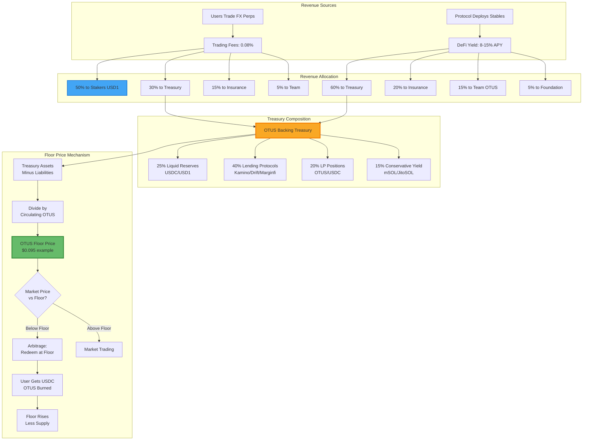

# OTUS Token Economics

> Treasury-Backed Yield Token for OtusFX Protocol

## Overview

OTUS is a treasury-backed token designed to capture protocol value while providing users with yield exposure. Unlike traditional governance tokens, OTUS has a mathematically enforced floor price backed by protocol revenue deployed in yield-generating DeFi positions.

**Core Innovation**: Stablecoins (USDC/USD1) remain deployed in DeFi protocols earning yield, while OTUS tokens serve as the settlement and reward layer, backed by this accumulating treasury.

## Token Mechanics

### Value Proposition

```
OTUS Floor Price = Treasury Value / OTUS Circulating Supply
```

As the treasury grows through yield and fees, the floor price rises. This creates a token where downside is limited (floor protection) while upside is tied to protocol success.

### How It Works

| Scenario | User Experience |
|----------|-----------------|
| **Lending Deposit** | Deposit USD1 → Withdraw USD1 principal + OTUS yield |
| **Trading Win** | Deposit USDC collateral → Close profitable → USDC + profits as OTUS |
| **Trading Loss** | Deposit USDC collateral → Close at loss → Settlement in OTUS |

### Capital Efficiency

Traditional perps pay profits in stables, draining liquidity. OtusFX retains stables in yield-generating positions:

```
┌─────────────────────────────────────────────────────────┐
│  User deposits $100K USDC                               │
│              ↓                                          │
│  Protocol deploys to Kamino/Drift/Marginfi (8-15% APY) │
│              ↓                                          │
│  Yield accumulates in Treasury                         │
│              ↓                                          │
│  Treasury backs OTUS tokens                            │
│              ↓                                          │
│  Users settle in OTUS (claim on growing treasury)      │
└─────────────────────────────────────────────────────────┘
```

---

## Token Distribution

**Total Supply: 1,000,000,000 OTUS**

| Allocation | % | Tokens | Vesting |
|------------|---|--------|---------|
| Community Rewards | 50% | 500M | 4-year emission schedule |
| Genesis Airdrop | 10% | 100M | TGE (bootstrap depositors) |
| Core Team | 20% | 200M | 12-month cliff → 24-month linear |
| Treasury Reserve | 12% | 120M | Unlocked (backs floor price) |
| Strategic Partners | 5% | 50M | 12-month cliff → 18-month linear |
| Liquidity | 3% | 30M | TGE |

### Distribution Visualization

```
Community (60%)     ████████████████████████░░░░░░░░░░░░░░░░
Team (20%)          ████████░░░░░░░░░░░░░░░░░░░░░░░░░░░░░░░░
Treasury (12%)      █████░░░░░░░░░░░░░░░░░░░░░░░░░░░░░░░░░░░
Partners (5%)       ██░░░░░░░░░░░░░░░░░░░░░░░░░░░░░░░░░░░░░░
Liquidity (3%)      █░░░░░░░░░░░░░░░░░░░░░░░░░░░░░░░░░░░░░░░
```

### Vesting Schedule

```
Month:    0    6    12   18   24   30   36   42   48
          │    │    │    │    │    │    │    │    │
Community ████░░░░░████░░░░░████░░░░░████░░░░░████  (Annual seasons)
Genesis   ████░░░░░░░░░░░░░░░░░░░░░░░░░░░░░░░░░░░░  (TGE)
Team      ░░░░░░░░░████████████████████████████░░░  (Cliff + Linear)
Partners  ░░░░░░░░░████████████████████░░░░░░░░░░░  (Cliff + Linear)
Treasury  ████████████████████████████████████████  (Available)
Liquidity ████░░░░░░░░░░░░░░░░░░░░░░░░░░░░░░░░░░░░  (TGE)
```

---

## Revenue Model

### Revenue Sources

1. **DeFi Yield** - Stablecoins deployed to lending protocols (8-15% APY)
2. **Trading Fees** - 0.08% per trade on perpetuals
3. **Lending Spread** - Borrow/lend rate differential
4. **Funding Rates** - Perpetual contract funding
5. **Liquidation Fees** - Position liquidation premium

### Dual Revenue Stream Model

**DeFi Yield Revenue** (from deployed stablecoins):

| Allocation | % | Purpose |
|------------|---|---------|
| **OTUS Backing** | 60% | Buyback or treasury accumulation |
| **Insurance Fund** | 20% | Risk buffer for black swan events |
| **Team Operations** | 15% | Paid in OTUS (aligned incentives) |
| **Foundation** | 5% | Grants, ecosystem development |

**Trading Fee Revenue** (from perpetual trading):

| Allocation | % | Purpose |
|------------|---|---------|
| **OTUS Stakers** | 50% | Direct fee cashback in USD1 |
| **OTUS Backing** | 30% | Additional treasury accumulation |
| **Insurance Fund** | 15% | Protocol safety net |
| **Team Operations** | 5% | Platform maintenance |

```
Annual Revenue Example ($2.8M)

DeFi Yield Revenue ($2M/year from deployed stables):
        │
        ├── 60% ($1.2M) → OTUS Backing
        │                  └── Buy OTUS from market OR
        │                      Add to treasury backing
        │
        ├── 20% ($400K) → Insurance Fund
        │                  └── Cover losses, maintain floor
        │
        ├── 15% ($300K) → Team (as OTUS)
        │                  └── Aligns team with token performance
        │
        └── 5% ($100K) → Foundation
                         └── Grants, audits, infrastructure

Trading Fee Revenue ($800K/year from perpetuals):
        │
        ├── 50% ($400K) → OTUS Stakers (in USD1)
        │                  └── Direct cashback to stakers
        │
        ├── 30% ($240K) → OTUS Backing
        │                  └── Additional treasury growth
        │
        ├── 15% ($120K) → Insurance Fund
        │                  └── Trading risk buffer
        │
        └── 5% ($40K) → Team
                        └── Operations and development
```

---

## OTUS Value Backing: Visual Flow

### Revenue → Treasury → Floor Price



### Treasury Accumulation Example

**Year 1** ($20M TVL, $50M/month trading):
```
DeFi Yield Revenue:
  $20M × 10% = $2M/year
  → 60% backing = $1.2M to treasury

Trading Fee Revenue:
  $50M × 12 months × 0.08% = $480K/year
  → 30% backing = $144K to treasury

Total Treasury Growth: $1.344M
OTUS Circulating: 150M
Floor Increase: $1.344M / 150M = +$0.009/year
```

**Year 3** (Cumulative):
```
Total Treasury: $4.032M
OTUS Circulating: 150M (no inflation)
Floor Price: $4.032M / 150M = $0.027

Components Backing Each OTUS:
├── $0.007 in liquid USDC (25%)
├── $0.011 in lending protocols (40%)
├── $0.005 in LP positions (20%)
└── $0.004 in LSTs (15%)
```

### What Backs OTUS Floor?

```
┌────────────────────────────────────────────────────────┐
│                  OTUS FLOOR PRICE                      │
├────────────────────────────────────────────────────────┤
│                                                        │
│  Real Assets in Treasury:                             │
│  ━━━━━━━━━━━━━━━━━━━━━━━━━━━                          │
│                                                        │
│  ✅ USDC/USD1 (immediate redemption)                  │
│  ✅ Kamino/Drift deposits (earning yield)             │
│  ✅ OTUS/USDC LP tokens (trading fees)                │
│  ✅ mSOL/JitoSOL (staking yield)                      │
│                                                        │
│  NOT Backed By:                                        │
│  ━━━━━━━━━━━━━━                                        │
│                                                        │
│  ❌ Token emissions (no inflation)                    │
│  ❌ Future promises (only realized revenue)           │
│  ❌ Team tokens (vested separately)                   │
│  ❌ Speculation (floor = math only)                   │
│                                                        │
│  Floor Protection:                                     │
│  ━━━━━━━━━━━━━━━━━                                     │
│                                                        │
│  • Redeem OTUS at floor price (2% fee)                │
│  • Auto-buyback if trading < 95% floor                │
│  • Burns reduce supply → floor rises                  │
│                                                        │
└────────────────────────────────────────────────────────┘
```

### Floor vs. Market Price Dynamics

```
Price ▲
      │
$0.15 │                    ╱────╲  ← Market price
      │                   ╱      ╲   (speculation + utility)
$0.12 │                  ╱        ╲
      │                 ╱          ╲
$0.10 │────────────────●────────────●──────  ← Floor price
      │               ╱              ╲      (treasury backing)
$0.09 │              ╱                ╲
      │             ╱                  ╲
      │  Arbitrage ╱                    ╲ Arbitrage
      │  zone     ╱                      ╲ zone
$0.05 │─────────●                          ●
      │
      └──────────────────────────────────────► Time

Key Points:
• Market price typically > floor (utility premium)
• If market < floor → arbitrage brings it back
• Floor only goes up (unless protocol loses money)
• Redemption provides absolute downside protection
```

---

## Treasury Management

### Asset Allocation Strategy

| Category | Target % | Purpose |
|----------|----------|---------|
| Liquid Reserves | 25% | Immediate redemption liquidity |
| Lending Protocols | 40% | Kamino, Drift, Marginfi |
| LP Positions | 20% | OTUS/USDC liquidity depth |
| Conservative Yield | 15% | mSOL, JitoSOL staking |

### Risk Mitigation

- **Protocol Diversification**: Max 25% allocation per DeFi protocol
- **Insurance Coverage**: Target 10-15% of TVL in insurance fund
- **Audit Requirements**: Only audited protocols with >$50M TVL
- **Multi-sig Control**: 4/7 multisig for treasury operations

---

## Token Utility

### Primary Uses

| Utility | Description |
|---------|-------------|
| **Settlement** | Trading PnL and lending yields paid in OTUS |
| **Collateral** | Use OTUS as trading margin (max 30% of position) |
| **Staking Boost** | Stake OTUS for enhanced lending APY (+2-5%) |
| **Fee Discount** | Hold OTUS for reduced trading fees (up to 50%) |
| **In-App Swap** | Exchange OTUS ↔ USDC/USD1 within OtusFX app |

### Fee Discount Tiers

| OTUS Holdings | Fee Discount |
|---------------|--------------|
| 1,000 OTUS | 10% |
| 10,000 OTUS | 25% |
| 50,000 OTUS | 40% |
| 100,000 OTUS | 50% |

### In-App OTUS Swap

Users can exchange OTUS for USDC/USD1 (and vice versa) directly within the OtusFX app:

- **Buy OTUS**: Exchange USDC/USD1 → OTUS at market rate
- **Sell OTUS**: Exchange OTUS → USDC/USD1 at market rate
- **Redemption**: Redeem OTUS at treasury floor price (with 2% fee)
- **No External DEX Required**: All swaps handled in-app for simplicity

> **Note**: OTUS is a standard SPL token and can be held in any Solana wallet, but swapping is only available through the OtusFX app interface.

---

## Price Floor Mechanism

### How the Floor Works

```
Floor Price = (Treasury Assets - Liabilities) / Circulating Supply

Example:
- Treasury: $10M in yield-bearing assets
- Liabilities: $500K reserved for pending settlements
- Circulating Supply: 100M OTUS
- Floor Price: ($10M - $0.5M) / 100M = $0.095

If OTUS trades at $0.08 (below floor):
- Protocol can buy back OTUS at discount
- Arbitrageurs buy cheap OTUS, redeem for treasury value
- Price returns to floor
```

### Floor Protection Mechanisms

1. **Redemption Window**: Users can redeem OTUS for treasury value (with fee)
2. **Protocol Buybacks**: Automatic buyback when trading below 95% of floor
3. **Emission Pause**: Halt new OTUS emissions if floor is threatened

---

## Bootstrap Phase

### Genesis Event

1. **Deposit Window** (2 weeks)
   - Users deposit USDC/USD1 into bootstrap vault
   - Funds immediately deployed to yield protocols

2. **Points Accumulation**
   - Points earned based on: deposit size × time × multiplier
   - Early depositors get 2x multiplier

3. **OTUS Airdrop** (TGE)
   - 10% of supply (100M OTUS) distributed pro-rata to points
   - No cliff, immediately liquid

### Post-Bootstrap

- Protocol goes live with perpetual trading
- Community rewards emission begins (Season 1)
- Trading generates fees → treasury grows → floor rises

---

## Economic Scenarios

### Bull Case: $50M TVL

| Metric | Value |
|--------|-------|
| TVL | $50M |
| DeFi Yield (10%) | $5M/year |
| Trading Volume | $200M/month |
| Trading Fees | $1.92M/year |
| Total Revenue | $6.92M/year |
| **To Stakers (50% of fees)** | **$960K/year** |
| **Staking APR*** | **8-16%** |
| OTUS Backing (DeFi 60% + Fees 30%) | $3.58M/year |
| Floor Increase | ~7.2% annually |

*Varies with amount staked and lock period

### Base Case: $20M TVL

| Metric | Value |
|--------|-------|
| TVL | $20M |
| DeFi Yield (10%) | $2M/year |
| Trading Volume | $50M/month |
| Trading Fees | $480K/year |
| Total Revenue | $2.48M/year |
| **To Stakers (50% of fees)** | **$240K/year** |
| **Staking APR*** | **4-8%** |
| OTUS Backing (DeFi 60% + Fees 30%) | $1.34M/year |
| Floor Increase | ~2.7% annually |

*Varies with amount staked and lock period

---

## Comparisons

### vs. Jupiter (JUP/JLP)
- JLP: LP token for perps counterparty
- **OTUS**: Similar counterparty model + treasury backing + settlement layer

### vs. Hyperliquid (HYPE/HLP)
- HYPE: 93% revenue to buyback/burn
- **OTUS**: 60% to backing (more conservative, sustainable)

### vs. Hylo (hyUSD/xSOL)
- hyUSD: Delta-neutral stablecoin backed by LSTs
- **OTUS**: Not pegged, but floor-protected by yield treasury

---

## Risks & Mitigations

| Risk | Mitigation |
|------|------------|
| DeFi Protocol Hack | Max 25% per protocol, insurance fund |
| Yield Compression | Multiple yield sources, trading fee revenue |
| Bank Run (Mass Redemption) | 25% liquid reserves, redemption queues |
| Trading Losses > Yield | Fee structure ensures house edge |
| OTUS Price Below Floor | Automatic buyback trigger |

---

## Summary

OTUS represents a new model for DeFi tokens:

1. **Real Backing**: Every OTUS is backed by productive treasury assets
2. **Rising Floor**: Protocol revenue grows the floor price over time
3. **Capital Efficient**: Stablecoins stay in yield protocols, OTUS is the settlement layer
4. **Aligned Incentives**: Team paid in OTUS, community gets 60% of supply
5. **Sustainable**: 60/20/15/5 revenue split balances growth and stability

---

## Appendix: Key Parameters

| Parameter | Value |
|-----------|-------|
| Total Supply | 1,000,000,000 OTUS |
| Initial Circulating | ~133M (13.3%) |
| Team Vesting | 12mo cliff + 24mo linear |
| Partner Vesting | 12mo cliff + 18mo linear |
| Community Emission | 4 years |
| Max Protocol Allocation | 25% of treasury |
| Liquid Reserve Target | 25% of treasury |
| Insurance Fund Target | 10-15% of TVL |
| Revenue to Backing | 60% |
| OTUS Collateral Cap | 30% of position |
